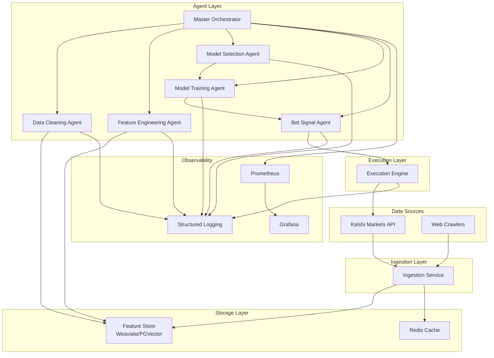

# Kalshi Trader - Multi-Agent Workflow

A production-ready system for automated betting against Kalshi odds using a multi-agent architecture with specialized agents for data processing, feature engineering, model training, and bet execution.

## Architecture Overview



## Quick Start

### Prerequisites

- Python 3.12+
- Poetry
- Docker & Docker Compose
- Redis
- Weaviate or PostgreSQL with pgvector

### Installation

```bash
# Clone the repository
git clone <repository-url>
cd kalshi-trader

# Install dependencies
poetry install

# Set up environment variables
cp .env.example .env
# Edit .env with your configuration
```

### Configuration

Set the following environment variables in your `.env` file:

```bash
KALSHI_API_KEY=your_kalshi_api_key
REDIS_URL=redis://localhost:6379
WEAVIATE_URL=http://localhost:8080
LOG_LEVEL=INFO
```

## Development

### Makefile Targets

```bash
# Development setup
make dev          # Install dev dependencies and set up pre-commit hooks
make install      # Install dependencies only

# Code quality
make lint         # Run ruff linter
make format       # Format code with black
make typecheck    # Run mypy type checking
make test         # Run pytest test suite

# Docker operations
make docker-build # Build Docker image
make docker-run   # Run container locally
make docker-push  # Push to registry

# Deployment
make deploy-dev   # Deploy to development environment
make deploy-prod  # Deploy to production environment
```

### Running the Application

#### Local Development

```bash
# Start the FastAPI server
poetry run kalshi-trader

# Or run directly
poetry run python -m kalshi_trader.cli
```

#### Docker Compose

```bash
# Start all services
docker-compose up -d

# View logs
docker-compose logs -f

# Stop services
docker-compose down
```

## API Endpoints

- `GET /health` - Health check endpoint
- `POST /predict` - Generate market predictions
- `GET /metrics` - Prometheus metrics (port 8000)

## Project Structure

```
kalshi_trader/
├── agents/                 # Specialized trading agents
│   ├── base.py            # Base agent class
│   ├── data_cleaning.py   # Data validation and cleaning
│   ├── feature_engineering.py # Feature generation
│   ├── model_selection.py # Model optimization
│   ├── model_training.py  # Model training and validation
│   └── bet_signal.py      # Signal generation
├── core/                  # Core system components
│   ├── orchestrator.py    # Master agent coordinator
│   ├── ingestion.py       # Data ingestion service
│   ├── feature_store.py   # Vector database interface
│   ├── execution.py       # Order execution engine
│   └── config.py          # Configuration management
├── observability/         # Monitoring and logging
│   ├── metrics.py         # Prometheus metrics
│   └── logging.py         # Structured logging
└── cli.py                 # FastAPI application
```

## Contributing

1. Fork the repository
2. Create a feature branch
3. Make your changes
4. Run tests and linting
5. Submit a pull request

## License

MIT License - see LICENSE file for details 